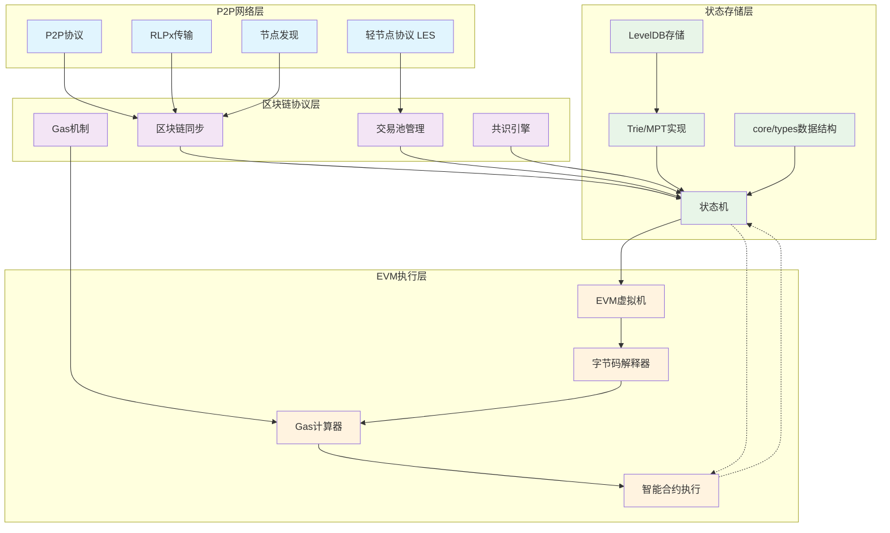

# **Go-Ethereum (Geth) 核心功能与架构设计研究**
# 1 **Geth 概述与生态定位**
## 1.1 起源与发展
起源：Geth（Go Ethereum）的起源可以追溯到2013年末以太坊区块链提案之后。其初始版本于2015年7月随以太坊网络启动时发布。

定义：Geth 是以太坊协议的官方 Go 语言实现，主要由以太坊基金会开发和维护。

地位：凭借 Go 语言的高效性和可扩展性，Geth 已成为最广泛采用的以太坊客户端之一，是以太坊生态系统的基石。

## 1.2 在以太坊生态中的角色
Geth 使开发者能够使用 Go 编程语言运行以太坊节点，并参与以太坊生态中的多种活动，主要包括：

节点运营：建立与以太坊网络的连接，处理交易并维护区块链的最新记录。

智能合约与 dApp 开发：在智能合约和去中心化应用程序（dApps）的创建与部署中发挥着不可或缺的作用。

网络维护：通过验证交易和保护网络来进行“挖矿”（在PoW阶段）操作。

灵活性：其多功能性使其能够以全节点、轻节点或私有网络配置等多种模式运行，根据用户需求提供灵活性。

# 2 **核心模块与交互关系**
## 2.1 区块链同步协议
Geth 实现了多种区块链同步协议（如 eth/62, eth/63），以确保节点能高效、准确地与网络状态同步。

跟随节点同步：Scroll 项目的文档中提到，其执行节点（基于 Geth 的分支）允许节点（跟随节点）使用以太坊的 p2p 协议同步区块链。这间接反映了 Geth 本身具备通过 p2p 协议进行区块同步的能力。

继承与兼容性：由于许多第二层（L2）解决方案（如 Scroll）直接分支或继承自 Geth，它们与以太坊在同步协议等层面的高度兼容性也印证了 Geth 在该领域的核心地位。

## 2.2 交易池管理与 Gas 机制
### 2.2.1 交易池
Geth 包含一个 交易池（Transaction pool） 模块，作为用于 L2 交易的内存池。在主网中，该模块负责管理待处理的交易。

在 L2 场景下，Geth 的分支（如 Scroll 的 l2geth）还需要从 L1 主网收集交易，并验证其顺序和有效性。

### 2.2.2 Gas 机制
Gas 作用：在兼容 EVM 的网络中，"Gas" 是用于衡量执行特定操作所需计算能力的单位，其作用是防止无限循环和拒绝服务（DoS）攻击。

Gas 费计算：自 EIP-1559（伦敦硬分叉）生效以来，Gas 费通过以下公式计算：
Gas fee = units of gas used * (base fee + priority fee)

Gas 优化核心：Gas 优化的核心理念是在 EVM 区块链上优先选择成本效率高的操作，避免 Gas 成本昂贵的操作。例如：

低成本操作：读**写内存变量、读取常量和不可变变量、读写本地变量等。

高成本操作：读**写存储在合约存储中的状态变量、外部函数调用、循环操作等。

## 2.3 EVM 执行环境构建
EVM 定义：以太坊虚拟机（Ethereum Virtual Machine, EVM）是以太坊区块链的核心执行引擎，负责处理智能合约的部署和执行。它是一个图灵完备的堆栈式虚拟机。

核心特征：

确定性执行：相同输入始终产生相同输出。

隔离环境：沙箱化运行防止系统级影响。

Gas 计量：计算资源消耗的量化体系。

Geth 中的集成：EVM 作为 Geth 的核心组件之一，负责处理以太坊的状态转换规则。当 Geth 节点需要执行一个智能合约或处理一笔交易时，它会调用 EVM 在隔离的沙箱环境中运行合约字节码。

## 2.4 共识算法实现
历史演进：Geth 完整实现了以太坊从 工作量证明（PoW） 到 权益证明（PoS） 的过渡。

Ethash：在 PoW 阶段，Geth 实现了 Ethash 共识算法，允许用户通过“挖矿”来验证交易和保护网络，从而获取以太币奖励。

PoS 过渡：Geth 在性能和与新兴以太坊升级（如以太坊 2.0 中从工作量证明(PoW)转向权益证明(PoS)）的兼容性方面的改进，对网络的可扩展性和持久性至关重要。Geth 的持续更新确保了其与共识层客户端（如 Prysm、Lighthouse）的顺畅交互，共同完成 PoS 共识。

# 3 **系统架构设计** 
P2P 网络层通过 Server 和 Peer 类为上层提供网络通信能力，ProtocolManager 作为协议管理器协调区块链同步协议的运行。Downloader 负责具体的区块同步逻辑，与对等节点进行数据交换。

交易池管理通过 TxPool 类接收网络层传播的交易，经过验证后存储在交易列表中。当矿工准备打包新区块时，从交易池中选取交易，通过 StateTransition 进行状态转换和 Gas 计算。

EVM 执行环境由 EVM 类构建，通过 EVMInterpreter 执行字节码，期间通过 StateDB 接口与状态存储层进行状态读写操作。Contract 类维护合约执行上下文，确保执行环境的隔离性。

共识算法通过 Engine 接口与区块链核心交互，Ethash 或 Clique 实现具体的共识逻辑。Miner 和 worker 类负责组织挖矿过程，将交易打包成区块并通过共识引擎进行密封。

状态存储层通过 StateDB 提供统一的状态访问接口，底层使用 Trie 实现默克尔帕特夏树来高效存储和验证状态数据。所有核心数据类型在 core/types 中定义，确保各模块间数据格式的一致性。

这种模块化的设计使得各组件职责清晰，通过定义良好的接口进行交互，既保证了系统的可维护性，又为功能扩展提供了灵活性。
## 3.1 分层架构图
以下是 Geth 简化后的核心分层架构图，展示了各层级之间的依赖关系：

--------------------------------------------------



--------------------------------------------------
## 3.2 各层关键模块说明
### 3.2.1 P2P 网络层
该层负责节点间的网络通信和数据交换，包含以下核心模块：

1. P2P协议：基于 DevP2P 的协议栈，负责建立和维护节点连接

2. RLPx传输：提供加密的点到点通信通道

3. 节点发现：基于 Kademlia DHT 协议实现节点动态发现

4. 轻节点协议（LES）：允许轻节点与全节点交互，降低资源消耗

**核心代码**
#### **P2P 协议实现**
```go
// p2p/server.go - P2P 服务器核心结构
type Server struct {
    // 配置参数
    Config
    // 节点数据库
    nodeDB *enode.DB
    // 运行状态
    running map[reflect.Type]bool
    // 协议管理器
    protocols []Protocol
    // 对等节点列表
    peers map[*Peer]bool
    // 添加对等节点的通道
    addpeer chan *Peer
    // 删除对等节点的通道
    delpeer chan peerDrop
}

// 启动 P2P 服务器
func (srv *Server) Start() error {
    if err := srv.setupLocalNode(); err != nil {
        return err
    }
    if srv.ListenAddr != "" {
        if err := srv.setupListening(); err != nil {
            return err
        }
    }
    if err := srv.setupDiscovery(); err != nil {
        return err
    }
    srv.loop()
    return nil
}

// 节点发现协议
func (srv *Server) setupDiscovery() error {
    // 使用 Kademlia DHT 进行节点发现
    discv, err := discover.ListenUDP(srv.PrivateKey, srv.ListenAddr, srv.NodeDatabase)
    if err != nil {
        return err
    }
    srv.discv = discv
    return nil
}
```
#### **轻节点协议 (LES)** 
```go
// les/client.go - 轻客户端实现
type LightEthereum struct {
    // 配置
    config *eth.Config
    // 对等节点集合
    peers        *peerSet
    // 请求分发器
    reqDist      *requestDistributor
    // 区块链
    blockchain   *light.LightChain
    // 交易池
    txPool       *light.TxPool
    // 协议管理器
    protocolManager *ProtocolManager
}

// LES 协议处理
func (pm *ProtocolManager) handleMsg(p *peer) error {
    msg, err := p.rw.ReadMsg()
    if err != nil {
        return err
    }
    defer msg.Discard()

    switch msg.Code {
    case GetBlockHeadersMsg:
        // 处理获取区块头请求
        var query getBlockHeadersData
        if err := msg.Decode(&query); err != nil {
            return err
        }
        headers := pm.getBlockHeaders(p, &query)
        return p.SendBlockHeaders(headers)
    
    case GetBlockBodiesMsg:
        // 处理获取区块体请求
        var req getBlockBodiesData
        if err := msg.Decode(&req); err != nil {
            return err
        }
        bodies := pm.getBlockBodies(p, req)
        return p.SendBlockBodies(bodies)
    
    // 其他消息处理...
    }
    return nil
}
```
### 3.2.2 区块链协议层
该层处理区块链的核心逻辑和共识机制：

1. 区块链同步：支持快速同步和完全同步等多种同步策略

2.  交易池管理：验证交易合法性，按 Gas 价格排序并管理待确认交易

3.  共识引擎：可插拔的共识算法组件（Ethash/PoS）

4.   Gas机制：计算资源消耗的计量和费用体系

**核心代码**
#### **交易池管理**
```go
// core/tx_pool.go - 交易池核心实现
type TxPool struct {
    config       TxPoolConfig
    chainconfig  *params.ChainConfig
    chain        blockChain
    gasPrice     *big.Int
    // 待处理交易
    pending      map[common.Address]*txList
    // 队列中的交易
    queue        map[common.Address]*txList
    // 所有交易
    all          *txLookup
    // 价格堆，用于按 Gas 价格排序
    priced       *txPricedList
}

// 添加交易到交易池
func (pool *TxPool) add(tx *types.Transaction, local bool) (replaced bool, err error) {
    // 验证交易基本格式
    if err := pool.validateTx(tx, local); err != nil {
        return false, err
    }
    
    // 检查 Nonce 连续性
    from, _ := types.Sender(pool.signer, tx)
    list := pool.pending[from]
    if list != nil && list.Overlaps(tx) {
        // 替换或跳过交易
        inserted, err := list.Add(tx, pool.config.PriceBump)
        if !inserted {
            return false, err
        }
        return true, nil
    }
    
    // 添加到待处理列表
    replaced, err = pool.enqueueTx(tx.Hash(), tx)
    if err != nil {
        return false, err
    }
    
    return replaced, nil
}

// Gas 价格验证
func (pool *TxPool) validateTx(tx *types.Transaction, local bool) error {
    // 检查 Gas 限制
    if tx.Gas() > pool.currentMaxGas {
        return ErrGasLimit
    }
    
    // 检查 Gas 价格是否低于最低要求
    if !local && tx.GasPriceIntCmp(pool.gasPrice) < 0 {
        return ErrUnderpriced
    }
    
    return nil
}
``` 
#### **共识引擎接口**

```go
// consensus/consensus.go - 共识引擎接口定义
type Engine interface {
    // 作者检索方法（用于 PoW）
    Author(header *types.Header) (common.Address, error)
    
    // 验证区块头
    VerifyHeader(chain ChainReader, header *types.Header, seal bool) error
    
    // 准备共识相关的区块字段
    Prepare(chain ChainReader, header *types.Header) error
    
    // 最终确定区块（应用状态变更）
    Finalize(chain ChainReader, header *types.Header, state *state.StateDB, 
             txs []*types.Transaction, uncles []*types.Header, receipts []*types.Receipt) error
    
    // 封存区块（PoW 挖矿或 PoS 签名）
    Seal(chain ChainReader, block *types.Block, results chan<- *types.Block, stop <-chan struct{}) error
    
    // 验证封印
    VerifySeal(chain ChainReader, header *types.Header) error
}

// Ethash PoW 共识实现
type Ethash struct {
    config Config
    // 缓存和数据集
    caches   *lru
    datasets *lru
}

// Seal 实现 PoW 挖矿
func (ethash *Ethash) Seal(chain consensus.ChainReader, block *types.Block, 
                          results chan<- *types.Block, stop <-chan struct{}) error {
    // 创建挖矿工作
    abort := make(chan struct{})
    found := make(chan *types.Block)
    
    ethash.lock.Lock()
    threads := ethash.threads
    ethash.lock.Unlock()
    
    // 启动多个挖矿线程
    for i := 0; i < threads; i++ {
        go func(id int, nonce uint64) {
            ethash.mine(block, id, nonce, abort, found)
        }(i, uint64(ethash.rand.Int63()))
    }
    
    // 等待结果
    select {
    case block := <-found:
        results <- block
    case <-stop:
        close(abort)
    }
    return nil
}
```

### 3.2.3 状态存储层
该层负责管理区块链的所有状态数据：

1. 状态机：处理区块和交易，应用状态转换的核心引擎

2. Trie/MPT实现：Merkle Patricia Trie 数据结构，用于高效存储和验证状态

3. LevelDB存储：持久化存储 Trie 节点数据、区块头和交易回执

4. core/types：定义区块、交易、收据等核心数据结构的模块

**核心代码**
#### **Trie (MPT) 实现**
```go
// trie/trie.go - Merkle Patricia Trie 核心实现
type Trie struct {
    root  node
    owner common.Hash
    // 数据库引用
    db *Database
}

// 获取键值
func (t *Trie) Get(key []byte) []byte {
    value, _ := t.TryGet(key)
    return value
}

func (t *Trie) TryGet(key []byte) ([]byte, error) {
    key = keybytesToHex(key)
    value, newroot, didResolve, err := t.tryGet(t.root, key, 0)
    if err == nil && didResolve {
        t.root = newroot
    }
    return value, err
}

// 插入键值
func (t *Trie) Update(key, value []byte) {
    if err := t.TryUpdate(key, value); err != nil {
        log.Error(fmt.Sprintf("Unhandled trie error: %v", err))
    }
}

func (t *Trie) TryUpdate(key, value []byte) error {
    k := keybytesToHex(key)
    if len(value) != 0 {
        _, n, err := t.insert(t.root, nil, k, valueNode(value))
        if err != nil {
            return err
        }
        t.root = n
    } else {
        _, n, err := t.delete(t.root, nil, k)
        if err != nil {
            return err
        }
        t.root = n
    }
    return nil
}

// 计算 Merkle 根哈希
func (t *Trie) Hash() common.Hash {
    hash, cached, _ := t.hashRoot(nil)
    t.root = cached
    return common.BytesToHash(hash.(hashNode))
}
```
#### **core/types 数据结构**
```go
// core/types/block.go - 区块数据结构
type Block struct {
    header       *Header
    uncles       []*Header
    transactions Transactions
    
    // 缓存
    hash atomic.Value
    size atomic.Value
}

type Header struct {
    ParentHash  common.Hash    `json:"parentHash"       gencodec:"required"`
    UncleHash   common.Hash    `json:"sha3Uncles"       gencodec:"required"`
    Coinbase    common.Address `json:"miner"            gencodec:"required"`
    Root        common.Hash    `json:"stateRoot"        gencodec:"required"`
    TxHash      common.Hash    `json:"transactionsRoot" gencodec:"required"`
    ReceiptHash common.Hash    `json:"receiptsRoot"     gencodec:"required"`
    Bloom       Bloom          `json:"logsBloom"        gencodec:"required"`
    Difficulty  *big.Int       `json:"difficulty"       gencodec:"required"`
    Number      *big.Int       `json:"number"           gencodec:"required"`
    GasLimit    uint64         `json:"gasLimit"         gencodec:"required"`
    GasUsed     uint64         `json:"gasUsed"          gencodec:"required"`
    Time        uint64         `json:"timestamp"        gencodec:"required"`
    Extra       []byte         `json:"extraData"        gencodec:"required"`
    MixDigest   common.Hash    `json:"mixHash"`
    Nonce       BlockNonce     `json:"nonce"`
}

// core/types/transaction.go - 交易数据结构
type Transaction struct {
    inner TxData    // 交易数据
    time  time.Time // 首次看到时间
    
    // 缓存
    hash atomic.Value
    size atomic.Value
    from atomic.Value
}

type LegacyTx struct {
    Nonce    uint64          // 账户交易序号
    GasPrice *big.Int        // Gas 价格
    Gas      uint64          // Gas 限制
    To       *common.Address `rlp:"nil"` // 接收地址，nil 表示合约创建
    Value    *big.Int        // 转账金额
    Data     []byte          // 调用数据
    V, R, S  *big.Int        // 签名数据
}

// EIP-1559 交易类型
type DynamicFeeTx struct {
    ChainID    *big.Int
    Nonce      uint64
    GasTipCap  *big.Int
    GasFeeCap  *big.Int
    Gas        uint64
    To         *common.Address `rlp:"nil"`
    Value      *big.Int
    Data       []byte
    AccessList AccessList
    V, R, S    *big.Int
}
```

### 3.2.4 EVM 执行层
该层是智能合约的沙箱化运行环境：

1. EVM虚拟机：基于堆栈的智能合约执行引擎

2. 字节码解释器：逐条解析和执行 EVM 操作码

3. Gas计算器：计量和扣除每条指令的计算资源消耗

4. 智能合约执行：在隔离环境中部署和运行智能合约代码

**核心代码**
#### **EVM 虚拟机核心**
```go
// core/vm/evm.go - EVM 虚拟机结构
type EVM struct {
    // 上下文
    Context Context
    // 状态数据库
    StateDB StateDB
    // 当前调用深度
    depth int
    
    // 配置
    chainConfig *params.ChainConfig
    // 规则集
    rules params.Rules
    
    // 解释器
    interpreter *EVMInterpreter
    // 中止标志
    abort int32
}

// 合约调用
func (evm *EVM) Call(caller ContractRef, addr common.Address, input []byte, 
                     gas uint64, value *big.Int) (ret []byte, leftOverGas uint64, err error) {
    
    // 检查调用深度
    if evm.depth > int(params.CallCreateDepth) {
        return nil, gas, ErrDepth
    }
    
    // 检查余额是否足够
    if !value.IsZero() && !evm.Context.CanTransfer(evm.StateDB, caller.Address(), value) {
        return nil, gas, ErrInsufficientBalance
    }
    
    snapshot := evm.StateDB.Snapshot()
    
    // 转账
    if !evm.StateDB.Exist(addr) {
        // 合约创建
        ret, _, err = evm.create(AccountRef(addr), input, gas, value)
    } else {
        // 合约调用
        ret, err = evm.call(caller, addr, input, gas, value)
    }
    
    if err != nil {
        evm.StateDB.RevertToSnapshot(snapshot)
    }
    
    return ret, gas, err
}

// EVM 解释器
type EVMInterpreter struct {
    evm *EVM
    cfg Config
    
    // Gas 表
    gasTable params.GasTable
    // 读取指令的接口
    readOnly bool
}

// 运行合约代码
func (in *EVMInterpreter) Run(contract *Contract, input []byte) (ret []byte, err error) {
    // 增加调用深度
    in.evm.depth++
    defer func() { in.evm.depth-- }()
    
    // 重置之前的返回数据
    contract.ReturnData = nil
    
    if len(contract.Code) == 0 {
        return nil, nil
    }
    
    var (
        op    OpCode        // 当前操作码
        mem   = NewMemory() // 内存
        stack = newstack()  // 栈
        // ... 其他变量
    )
    
    // 主循环
    for {
        // 获取下一个操作码
        op = contract.GetOp(pc)
        
        // 计算 Gas 消耗
        cost, err = operation.gasCost(in.gasTable, in.evm, contract, stack, mem, memorySize)
        if err != nil || !contract.UseGas(cost) {
            return nil, ErrOutOfGas
        }
        
        // 执行操作
        res, err := operation.execute(&pc, in.evm, contract, mem, stack)
        if err != nil {
            return nil, err
        }
        
        // 检查是否中止
        if in.evm.abort != 0 {
            return nil, errStopToken
        }
    }
}
```
#### **Gas 计算机制**
```go
// core/vm/gas.go - Gas 计算函数
// 计算内存扩展的 Gas 消耗
func memoryGasCost(mem *Memory, newMemSize uint64) (uint64, error) {
    if newMemSize == 0 {
        return 0, nil
    }
    
    // 当前内存大小（以字为单位）
    currentSize := toWordSize(mem.Len())
    newSize := toWordSize(newMemSize)
    
    if newSize > 0xffffffffe0 {
        return 0, errGasUintOverflow
    }
    
    // 内存扩展的 Gas 消耗公式
    if newSize > currentSize {
        newWords := newSize - currentSize
        newFee := (newWords * params.MemoryGas) + (newWords * newWords / params.QuadCoeffDiv)
        oldFee := (currentSize * params.MemoryGas) + (currentSize * currentSize / params.QuadCoeffDiv)
        totalFee := newFee - oldFee
        
        if totalFee > 0 && totalFee < newFee {
            return totalFee, nil
        }
    }
    return 0, nil
}

// 计算 SSTORE 操作的 Gas 消耗
func gasSStore(evm *EVM, contract *Contract, stack *Stack, mem *Memory, memorySize uint64) (uint64, error) {
    var (
        y, x = stack.Back(1), stack.Back(0)
        current = evm.StateDB.GetState(contract.Address(), x.Bytes32())
    )
    
    // EIP-1283 实现
    original := evm.StateDB.GetCommittedState(contract.Address(), x.Bytes32())
    if original == current {
        if original == (common.Hash{}) {
            return params.SstoreSetGas, nil
        }
        if y == (common.Hash{}) {
            return params.SstoreClearGas, nil
        }
        return params.SstoreResetGas, nil
    }
    
    // 更复杂的 Gas 计算逻辑...
    return params.SstoreResetGas, nil
}
```

## 3.3 数据流向说明
架构中的数据流向遵循以下路径：

网络到协议：P2P 层接收的区块和交易数据传递给协议层处理

协议到存储：验证通过的交易和区块由协议层提交到存储层持久化

协议到执行：需要执行的智能合约调用从协议层传递到 EVM 执行层

执行与存储交互：EVM 执行过程中读取和修改的状态数据与存储层双向交互

状态回写：执行完成的状态变更最终写回到存储层的状态数据库中

这种分层架构确保了各模块职责单一、耦合度低，同时通过清晰的接口定义保证了系统整体的可维护性和扩展性。

# 4 **总结** 
Go-Ethereum (Geth) 作为以太坊协议的官方 Go 实现，其架构经过精心设计，模块之间职责清晰、协作紧密。从 P2P 网络通信到区块链数据同步，从交易池管理到基于 Gas 的资源计量，从状态存储的 MPT 到沙箱执行的 EVM，每一层都体现了对去中心化、安全性和性能的考量。理解 Geth 的架构设计，不仅是理解以太坊如何运作的关键，也为进一步研究区块链技术、开发底层协议或构建上层应用奠定了坚实的基础。
