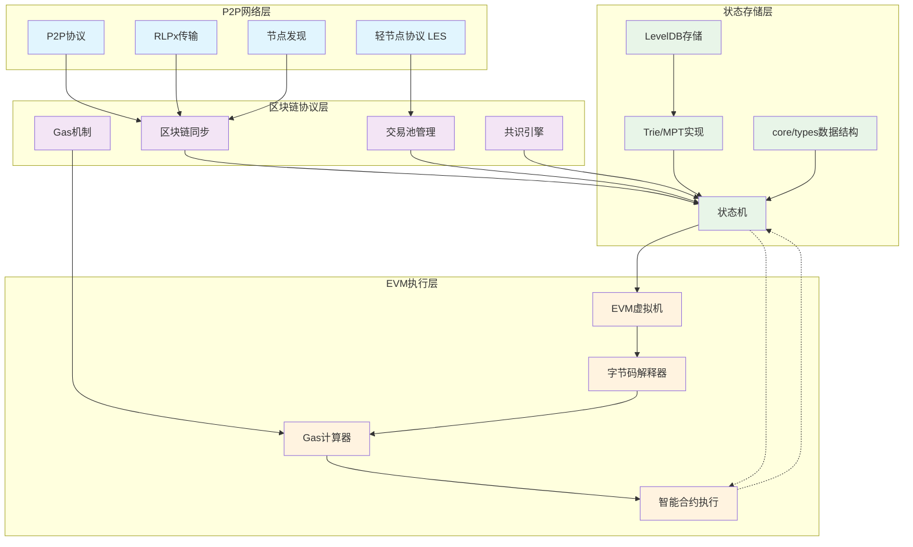

# **Go-Ethereum (Geth) 核心功能与架构设计研究**
# 1 **Geth 概述与生态定位**
## 1.1 起源与发展
起源：Geth（Go Ethereum）的起源可以追溯到2013年末以太坊区块链提案之后。其初始版本于2015年7月随以太坊网络启动时发布。

定义：Geth 是以太坊协议的官方 Go 语言实现，主要由以太坊基金会开发和维护。

地位：凭借 Go 语言的高效性和可扩展性，Geth 已成为最广泛采用的以太坊客户端之一，是以太坊生态系统的基石。

## 1.2 在以太坊生态中的角色
Geth 使开发者能够使用 Go 编程语言运行以太坊节点，并参与以太坊生态中的多种活动，主要包括：

节点运营：建立与以太坊网络的连接，处理交易并维护区块链的最新记录。

智能合约与 dApp 开发：在智能合约和去中心化应用程序（dApps）的创建与部署中发挥着不可或缺的作用。

网络维护：通过验证交易和保护网络来进行“挖矿”（在PoW阶段）操作。

灵活性：其多功能性使其能够以全节点、轻节点或私有网络配置等多种模式运行，根据用户需求提供灵活性。

# 2 **核心模块与交互关系**
## 2.1 区块链同步协议
Geth 实现了多种区块链同步协议（如 eth/62, eth/63），以确保节点能高效、准确地与网络状态同步。

跟随节点同步：Scroll 项目的文档中提到，其执行节点（基于 Geth 的分支）允许节点（跟随节点）使用以太坊的 p2p 协议同步区块链。这间接反映了 Geth 本身具备通过 p2p 协议进行区块同步的能力。

继承与兼容性：由于许多第二层（L2）解决方案（如 Scroll）直接分支或继承自 Geth，它们与以太坊在同步协议等层面的高度兼容性也印证了 Geth 在该领域的核心地位。

## 2.2 交易池管理与 Gas 机制
### 2.2.1 交易池
Geth 包含一个 交易池（Transaction pool） 模块，作为用于 L2 交易的内存池。在主网中，该模块负责管理待处理的交易。

在 L2 场景下，Geth 的分支（如 Scroll 的 l2geth）还需要从 L1 主网收集交易，并验证其顺序和有效性。

### 2.2.2 Gas 机制
Gas 作用：在兼容 EVM 的网络中，"Gas" 是用于衡量执行特定操作所需计算能力的单位，其作用是防止无限循环和拒绝服务（DoS）攻击。

Gas 费计算：自 EIP-1559（伦敦硬分叉）生效以来，Gas 费通过以下公式计算：
Gas fee = units of gas used * (base fee + priority fee)

Gas 优化核心：Gas 优化的核心理念是在 EVM 区块链上优先选择成本效率高的操作，避免 Gas 成本昂贵的操作。例如：

低成本操作：读**写内存变量、读取常量和不可变变量、读写本地变量等。

高成本操作：读**写存储在合约存储中的状态变量、外部函数调用、循环操作等。

## 2.3 EVM 执行环境构建
EVM 定义：以太坊虚拟机（Ethereum Virtual Machine, EVM）是以太坊区块链的核心执行引擎，负责处理智能合约的部署和执行。它是一个图灵完备的堆栈式虚拟机。

核心特征：

确定性执行：相同输入始终产生相同输出。

隔离环境：沙箱化运行防止系统级影响。

Gas 计量：计算资源消耗的量化体系。

Geth 中的集成：EVM 作为 Geth 的核心组件之一，负责处理以太坊的状态转换规则。当 Geth 节点需要执行一个智能合约或处理一笔交易时，它会调用 EVM 在隔离的沙箱环境中运行合约字节码。

## 2.4 共识算法实现
历史演进：Geth 完整实现了以太坊从 工作量证明（PoW） 到 权益证明（PoS） 的过渡。

Ethash：在 PoW 阶段，Geth 实现了 Ethash 共识算法，允许用户通过“挖矿”来验证交易和保护网络，从而获取以太币奖励。

PoS 过渡：Geth 在性能和与新兴以太坊升级（如以太坊 2.0 中从工作量证明(PoW)转向权益证明(PoS)）的兼容性方面的改进，对网络的可扩展性和持久性至关重要。Geth 的持续更新确保了其与共识层客户端（如 Prysm、Lighthouse）的顺畅交互，共同完成 PoS 共识。

# 3 **系统架构设计** 
## 3.1 分层架构图
以下是 Geth 简化后的核心分层架构图，展示了各层级之间的依赖关系：

--------------------------------------------------

--------------------------------------------------
## 3.2 各层关键模块说明
### 3.2.1 P2P 网络层
该层负责节点间的网络通信和数据交换，包含以下核心模块：

P2P协议：基于 DevP2P 的协议栈，负责建立和维护节点连接

RLPx传输：提供加密的点到点通信通道

节点发现：基于 Kademlia DHT 协议实现节点动态发现

轻节点协议（LES）：允许轻节点与全节点交互，降低资源消耗

### 3.2.2 区块链协议层
该层处理区块链的核心逻辑和共识机制：

区块链同步：支持快速同步和完全同步等多种同步策略

交易池管理：验证交易合法性，按 Gas 价格排序并管理待确认交易

共识引擎：可插拔的共识算法组件（Ethash/PoS）

Gas机制：计算资源消耗的计量和费用体系

### 3.2.3 状态存储层
该层负责管理区块链的所有状态数据：

状态机：处理区块和交易，应用状态转换的核心引擎

Trie/MPT实现：Merkle Patricia Trie 数据结构，用于高效存储和验证状态

LevelDB存储：持久化存储 Trie 节点数据、区块头和交易回执

core/types：定义区块、交易、收据等核心数据结构的模块

### 3.2.4 EVM 执行层
该层是智能合约的沙箱化运行环境：

EVM虚拟机：基于堆栈的智能合约执行引擎

字节码解释器：逐条解析和执行 EVM 操作码

Gas计算器：计量和扣除每条指令的计算资源消耗

智能合约执行：在隔离环境中部署和运行智能合约代码

## 3.3 数据流向说明
架构中的数据流向遵循以下路径：

网络到协议：P2P 层接收的区块和交易数据传递给协议层处理

协议到存储：验证通过的交易和区块由协议层提交到存储层持久化

协议到执行：需要执行的智能合约调用从协议层传递到 EVM 执行层

执行与存储交互：EVM 执行过程中读取和修改的状态数据与存储层双向交互

状态回写：执行完成的状态变更最终写回到存储层的状态数据库中

这种分层架构确保了各模块职责单一、耦合度低，同时通过清晰的接口定义保证了系统整体的可维护性和扩展性。

# 4 **总结** 
Go-Ethereum (Geth) 作为以太坊协议的官方 Go 实现，其架构经过精心设计，模块之间职责清晰、协作紧密。从 P2P 网络通信到区块链数据同步，从交易池管理到基于 Gas 的资源计量，从状态存储的 MPT 到沙箱执行的 EVM，每一层都体现了对去中心化、安全性和性能的考量。理解 Geth 的架构设计，不仅是理解以太坊如何运作的关键，也为进一步研究区块链技术、开发底层协议或构建上层应用奠定了坚实的基础。
